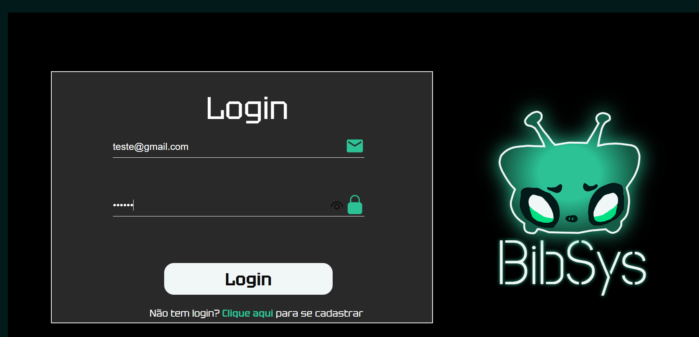
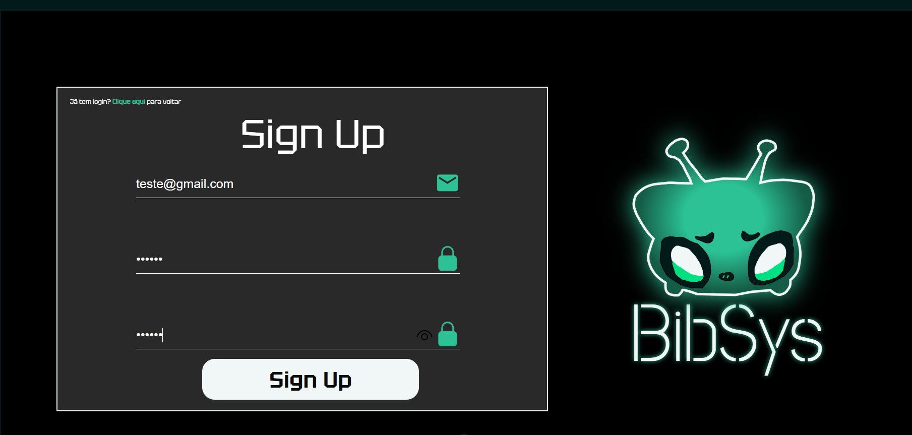
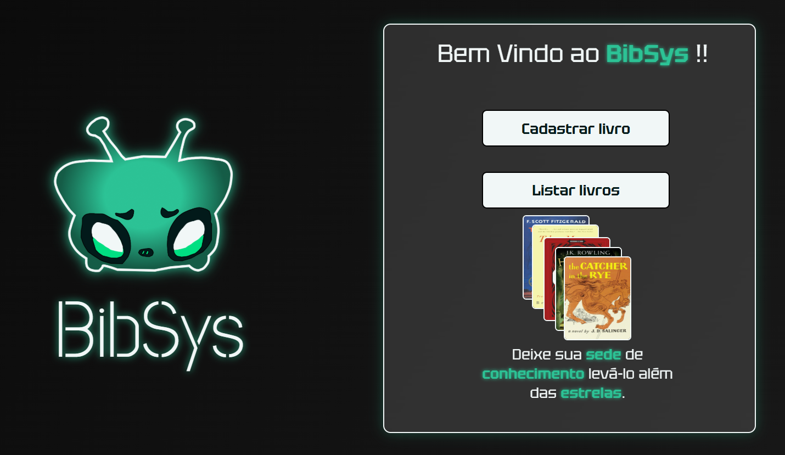
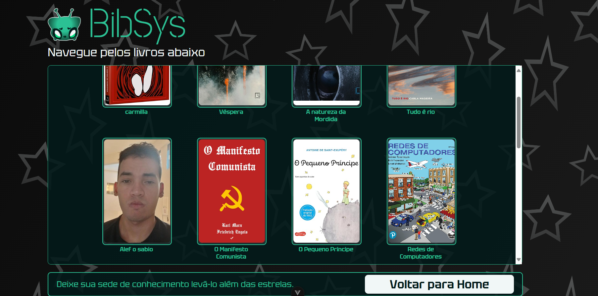
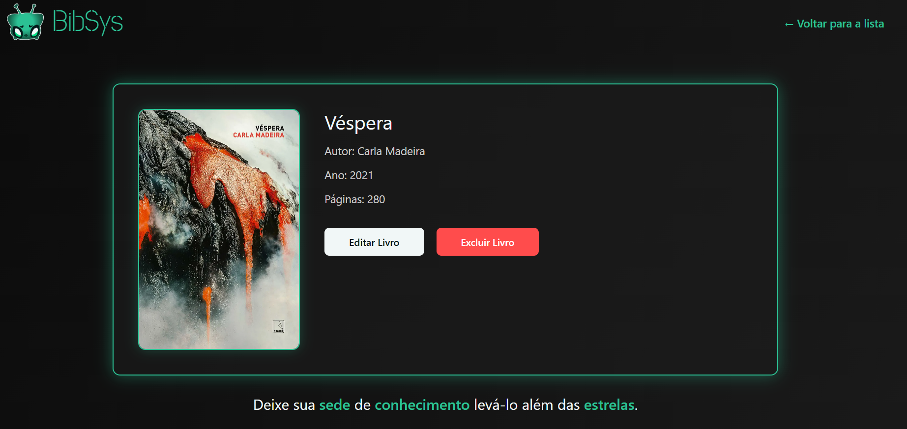
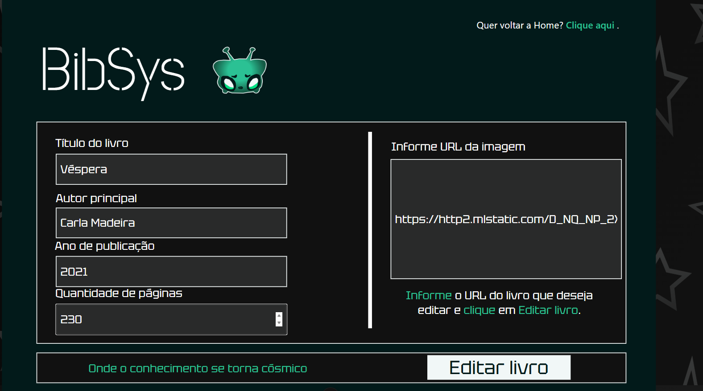

Este projeto consiste em um sistema para o gerenciamento de livros,desenvolvido com **Node.js (Express + Supabase)** no back-end e **Vue 3 + Vite** no front-end. Permitindo que usuários realizem operações essenciais como cadastro de novos livros, listagem, consulta de detalhes, edição e exclusão.

---

## 🚀 Instalação

Clone o repositório e siga os passos abaixo:

### 1. Back-end

```bash
cd server
npm install
```

### 2. Front-end

```bash
cd ..
cd client
npm install
```

## 🔑 Variáveis de Ambiente

```env
SUPABASE_URL=your_supabase_url
SUPABASE_KEY=your_supabase_anon_key
PORT=3333

SUPABASE_ACCESS_TOKEN=your_supabase_token
SUPABASE_DB_PASSWORD=your_supabase_password
```

## ⚙️ Migration

Caso seja necessário executar as migrações do banco, utilizar:

```bash
cd server
npm run migration
```

## ▶️ Execução

### Iniciar o Back-end

Na pasta raiz, rodar

```bash
cd server
npm run dev
```

### Iniciar o Front-end

Na pasta raiz, rodar

```bash
cd client
npm run dev
```

## 🔗 Acesse o Sistema

Abra no navegador:  
👉 [http://127.0.0.1:5173/](http://127.0.0.1:5173/)

## 🛠️ Tecnologias utilizadas

- Node.js + Express
- Supabase
- Vue 3 + Vite
- Axios

## 🖼️ Interface

###  Tela de Login
Tela onde o usuário acessa o sistema utilizando seu **e-mail e senha previamente cadastrados**.  



### Tela de Cadastro de Usuário
Tela utilizada para **registrar um novo usuário**, informando e-mail e senha, permitindo assim o acesso ao sistema.  



###  Tela Home
Tela onde o usuário pode escolher entre **cadastrar novos livros** ou **listar os já cadastrados**.  



### Tela de Catálogo de Livros
Tela onde o usuário pode visualizar **todos os livros disponíveis** e escolher qual deseja ver em mais detalhes.  




###  Tela de Detalhes do Livro
Tela onde o usuário pode visualizar **todas as informações de um livro**, além de escolher se deseja **editar ou excluir**.  




###  Tela de Edição de Livro
Tela onde o usuário pode **editar as informações de um livro** já cadastrado no sistema.  



## 📂 Estrutura do código

```bash
📂 BibSys                               # Pasta raiz do projeto
├── 📂 client                           # Front-End (Vue 3 + Vite)
│   ├── 📂 node_modules                 # Dependências - Front
│   ├── 📂 Pngs                         # Imagens utilizadas pelo projeto
│   ├── 📂 public                       # Arquivos públicos (favicon)
│   ├── 📂 src                          # Código fonte principal - Front
│   │   ├── 📂 assets                   # Arquivos estáticos (rotas)
│   │   ├── 📂 components               # Componentes reutilizáveis (Loading)
│   │   ├── 📂 type                     # Definição de tipos (Book)
│   │   ├── 📂 utils                    # Funções auxiliares
│   │   ├── 📄 App.vue                  # Componente raiz do Vue
│   │   ├── 📄 Cadastrarlivro.vue       # Página de cadastro de livros
│   │   ├── 📄 Cadastro_usuario.vue     # Página de registro de usuários
│   │   ├── 📄 Editarlivro.vue          # Página de edição de livros
│   │   ├── 📄 Home.vue                 # Página inicial
│   │   ├── 📄 Listarlivro.vue          # Página de exibição de todos os livros
│   │   ├── 📄 Livro.vue                # Página de exibição de um livro
│   │   ├── 📄 login.vue                # Página de login
│   │   ├── 📄 main.js                  # Arquivo principal
│   │   └── 📄 router.js                # Configuração das rotas
│   │   └── 📄 shims-vue.d.ts           # Definição para suportar arquivos .vue no TypeScript
│   ├── 📄 .gitignore                   # Itens ignorados pelo Git - Front
│   ├── 📄 index.html                   # Arquivo que carrega o Vue
│   ├── 📄 jsconfig.json                # Configurações do JavaScript - Front
│   ├── 📄 package-lock.json            # Versões das dependências - Front
│   ├── 📄 package.json                 # Dependências e scripts - Front
│   ├── 📄 README.md                    # Documentação - Front
│   └── 📄 vite.config.js               # Configuração do vite
├── 📂 server                           # Back-End (Node.js + Express + Supabase)
│   ├── 📂 node_modules                 # Dependências - Back
│   ├── 📂 src                          # Código fonte principal - Back
│   │   ├── 📄 server.ts                # Rotas do express
│   │   ├── 📄 supabaseConnection.ts    # Conexão com o Supabase
│   ├── 📂 supabase                     # Banco de Dados - Supabase
│   │   ├── 📂 migrations               # Scripts de migração do banco de dados
│   ├── 🔑 .env                         # Variáveis de ambiente
│   ├── 🔑 .env.example                 # Exemplo das variáveis de ambiente
│   ├── 📄 package-lock.json            # Versões das dependências - Front
│   ├── 📄 package.json                 # Dependências e scripts - Front
│   └── 📄 tsconfig.json                # Configurações do TypeScript - Back
├── 📄 .gitignore                       # Itens ignorados pelo Git do projeto
└── 📄 README.md                        # Documentação do projeto

```
