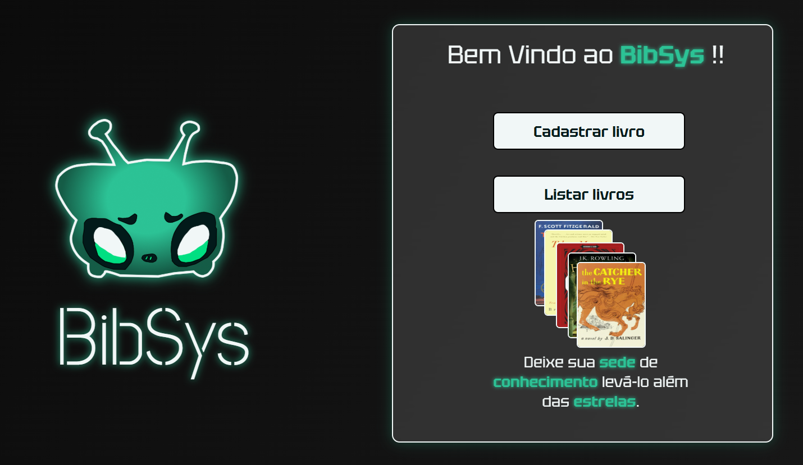
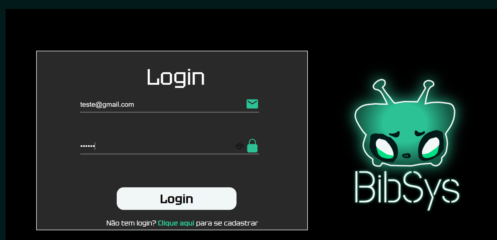
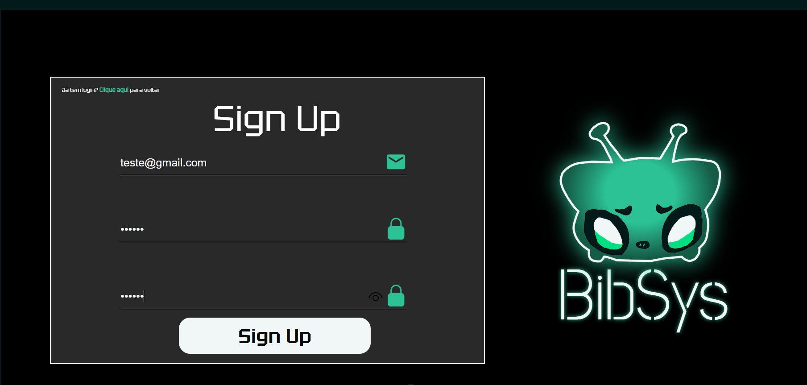
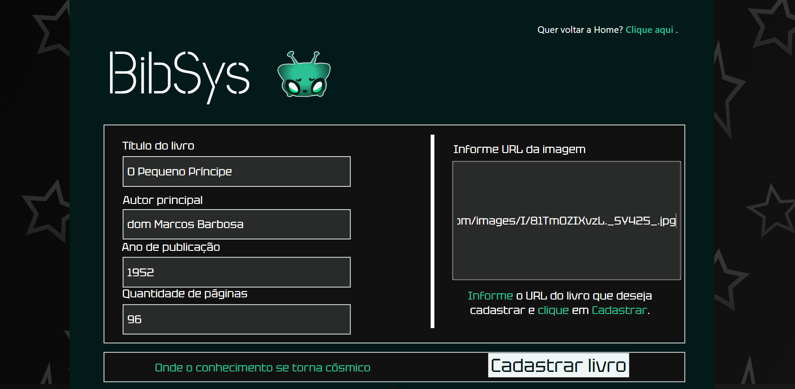

Sistema simples de gerenciamento de livros, desenvolvido com **Node.js (Express + Supabase)** no back-end e **Vue 3 + Vite** no front-end.

---

## 🚀 Instalação

Clone o repositório e siga os passos abaixo:

### 1. Back-end

```bash
cd server
npm install
```

### 2. Front-end

```bash
cd ..
cd client
npm install
```

## 🔑 Variáveis de Ambiente

```env
SUPABASE_URL=your_supabase_url
SUPABASE_KEY=your_supabase_anon_key
PORT=3333

SUPABASE_ACCESS_TOKEN=your_supabase_token
SUPABASE_DB_PASSWORD=your_supabase_password
```

## ⚙️ Migration

Caso seja necessário executar as migrações do banco, utilizar:

```bash
cd server
npm run migration
```

## ▶️ Execução

### Iniciar o Back-end

Na pasta raiz, rodar

```bash
cd server
npm run dev
```

### Iniciar o Front-end

Na pasta raiz, rodar

```bash
cd client
npm run dev
```

## 🔗 Acesse o Sistema

Abra no navegador:  
👉 [http://127.0.0.1:5173/](http://127.0.0.1:5173/)

## 🛠️ Tecnologias utilizadas

- Node.js + Express
- Supabase
- Vue 3 + Vite
- Axios

## 🖼️ Interface

### Tela Home
Tela onde o usuário pode escolher entre **cadastrar novos livros** ou **listar os já cadastrados**.  



### Tela de Login
Tela onde o usuário acessa o sistema utilizando seu **e-mail e senha previamente cadastrados**.  



### Tela de Cadastro de Usuário
Tela utilizada para **registrar um novo usuário**, informando e-mail e senha, permitindo assim o acesso ao sistema.  



### Tela de Cadastro de Livro
Tela onde o usuário pode **criar um novo registro de livro**, preenchendo suas informações para adicioná-lo ao sistema.  




## 📂 Estrutura do código

```bash
📂 BibSys
├── 📂 client
│   └── 📂 vue-Basic
│       ├── 📂 node_modules
│       ├── 📂 Pngs
│       ├── 📂 public
│       ├── 📂 src
│       │   ├── 📂 assets
│       │   ├── 📂 utils
│       │   ├── 📄 App.vue
│       │   ├── 📄 Cadastrarlivro.vue
│       │   ├── 📄 Cadastro_usuario.vue
│       │   ├── 📄 Editarlivro.vue
│       │   ├── 📄 Home.vue
│       │   ├── 📄 Listarlivro.vue
│       │   ├── 📄 Livro.vue
│       │   ├── 📄 login.vue
│       │   ├── 📄 main.js
│       │   └── 📄 router.js
│       ├── 📄 .gitignore
│       ├── 📄 index.html
│       ├── 📄 jsconfig.json
│       ├── 📄 package-lock.json
│       ├── 📄 package.json
│       ├── 📄 README.md
│       └── 📄 vite.config.js
├── 📂 server
│   ├── 📂 node_modules
│   ├── 📂 src
│   │   ├── server.ts
│   │   ├── supabaseConnection.ts
│   ├── 📂 supabase
│   │   ├── 📂 migrations
│   ├── 🔑 .env
│   ├── 🔑 .env.example
│   ├── 📄 package-lock.json
│   ├── 📄 package.json
│   └── 📄 tsconfig.json
├── 📄 .gitignore
└── 📄 README.md

```
